# Private Hospital Management Game Design

## Overview

The Private Hospital Management Game is a completely fictional offline Flutter-based mobile simulation where players manage a virtual hospital. All characters, events, and scenarios are entirely fictional with no connection to real-world healthcare data, regulations, or personalities. Any resemblance to real-life situations is purely coincidental.

### Game Domain
This is a **Business Management Simulation Game** featuring:
- Virtual hospital ownership and strategic decision-making
- Fictional staff hiring, duty assignment, and comprehensive benefits management
- Simulated penalty systems for malpractice and regulatory violations
- Complete salary structure with benefits, bonuses, and retirement planning
- Department-specific staff allocation (OPD vs Emergency)
- Performance-based rewards and legal consequences system

### Core Gameplay Challenge
Players must successfully manage a fictional private hospital while balancing multiple objectives: maintaining staff satisfaction through competitive compensation packages, avoiding legal penalties through proper staff training and duty allocation, ensuring department-specific expertise, and building long-term employee loyalty through retirement benefits and career development.

## Game Architecture

The game follows Flutter's official architecture recommendations with clean separation between presentation, domain, and data layers, optimized for offline gameplay.

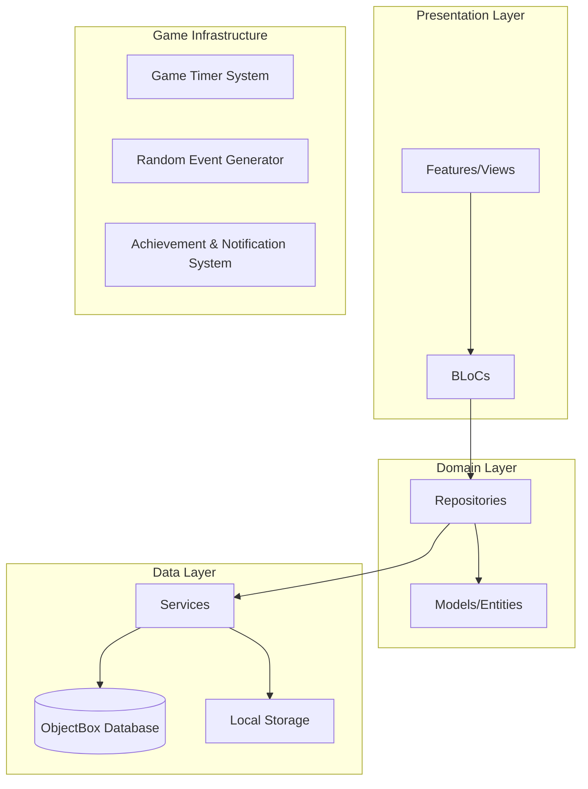

### Architectural Principles
- **Repository Pattern**: Each domain model has dedicated repository for CRUD operations
- **Reactive Interface**: Repositories provide observable streams for real-time game updates
- **Single Model Responsibility**: Each repository manages only one entity type
- **Offline-First Design**: All game data stored locally using ObjectBox
- **Composable Features**: UI components reusable across different game screens
- **Event-Driven Updates**: Game events trigger automatic state synchronization

## Game Domain Models

### Hospital Business Management

| Entity | Key Attributes | Business Rules |
|--------|---------------|----------------|
| **Hospital** | name, reputation, totalFunds, dailyExpenses, legalComplianceScore, penaltyHistory | Legal violations result in fines and reputation damage |
| **Department** | name, type (OPD/Emergency), requiredStaffCount, assignedStaff, operatingHours | Must maintain minimum qualified staff ratios |
| **LegalPenalty** | amount, reason, date, severity, complianceRequirement | Accumulated penalties affect hospital license status |

### Staff Management & Compensation

| Entity | Key Attributes | Business Rules |
|--------|---------------|----------------|
| **Staff** | name, assignedDepartment, dutyStatus, baseSalary, totalCompensation, hireDate | Must be assigned to specific department duties |
| **SalaryStructure** | basePay, performanceBonus, departmentAllowance, overtimeRate, benefits | Department-specific pay scales and allowances |
| **EmployeeBenefits** | healthInsurance, paidLeave, retirementContribution, bonusEligibility | Comprehensive benefits package affects retention |
| **RetirementPlan** | contributionPercent, vestingPeriod, currentBalance, withdrawalEligibility | Long-term employee financial security |

### Department Duty Assignment

| Entity | Key Attributes | Business Rules |
|--------|---------------|----------------|
| **DutyAssignment** | staffId, departmentType, shiftType, specialtyRequired, isActive | Staff can only work in assigned departments |
| **PerformanceRecord** | staffId, treatmentOutcome, patientSatisfaction, complianceScore | Poor performance triggers penalties |
| **MalpracticePenalty** | staffId, incidentType, penaltyAmount, suspensionDays, trainingRequired | Wrong treatment decisions have consequences |

### Patient Care & Treatment Outcomes

| Entity | Key Attributes | Business Rules |
|--------|---------------|----------------|
| **Patient** | name, economicStatus, condition, assignedDepartment, treatmentOutcome | Fictional patients with simulated conditions |
| **Treatment** | type, complexity, requiredSpecialty, successRate, riskLevel | Outcome depends on staff competency and assignment |
| **TreatmentOutcome** | success, complications, patientSatisfaction, legalCompliance | Failed treatments may result in legal action |

## Game Mechanics & Business Logic

### Staff Duty Assignment System

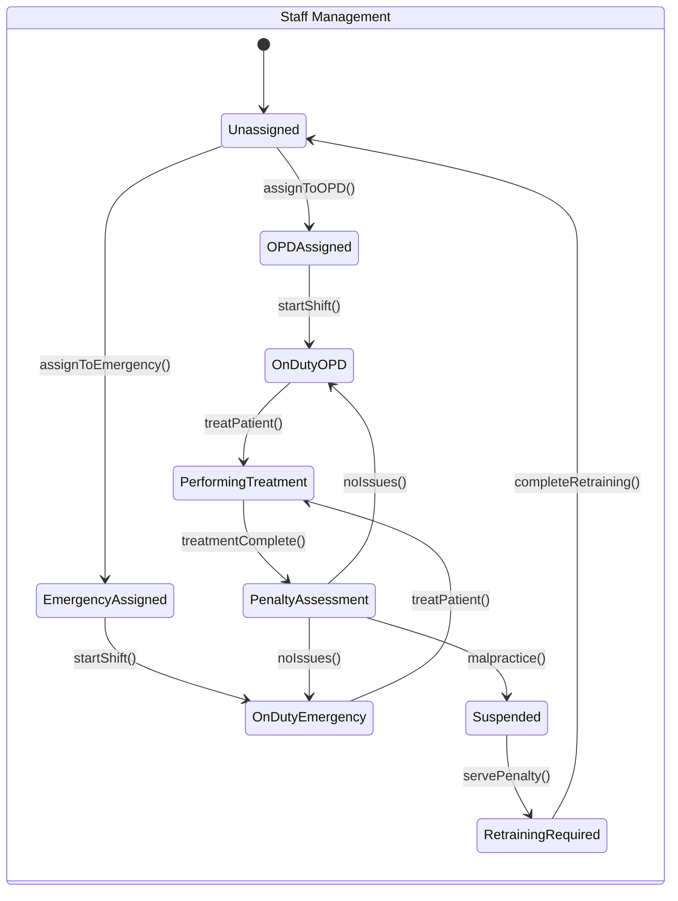

### Penalty and Legal Compliance System

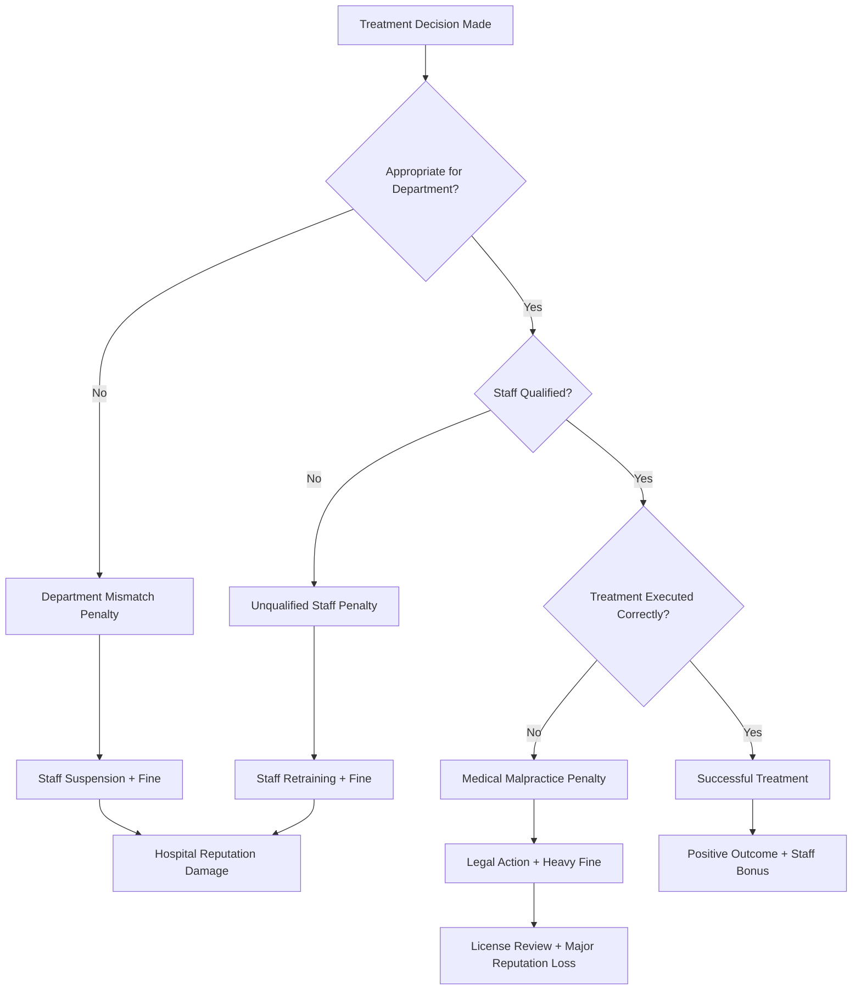

### Comprehensive Salary and Benefits System

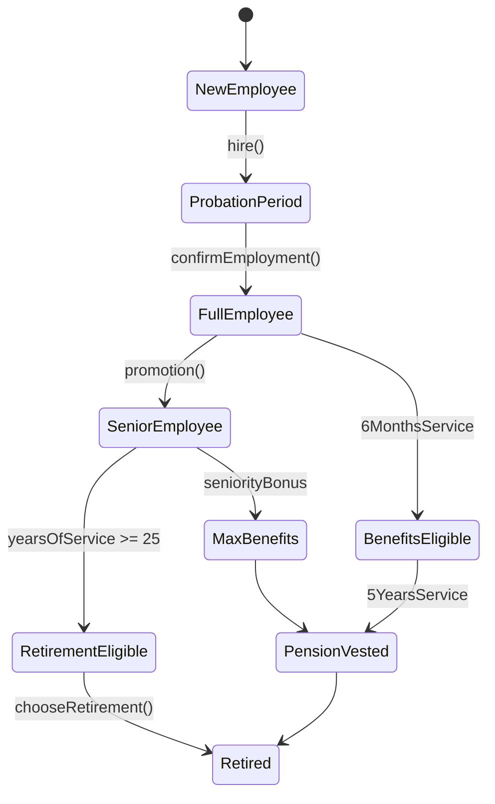

## Game Features Architecture

### Hospital Owner Dashboard
- **Financial Overview**: Real-time revenue, expenses, profit/loss, penalty costs tracking
- **Legal Compliance Monitor**: Current compliance score, pending penalties, license status
- **Department Staffing Panel**: Real-time view of staff assignments and duty status
- **Staff Performance Metrics**: Individual and department-wide performance tracking
- **Penalty Management System**: History of violations, current suspensions, compliance actions

### Advanced Staff Management System

#### Comprehensive Hiring and Assignment
- **Department-Specific Recruitment**: Hire staff with qualifications for OPD or Emergency duties
- **Duty Assignment Interface**: Explicitly assign staff to specific departments and shifts
- **Qualification Verification**: Ensure staff have required certifications for assigned duties
- **Cross-Training Programs**: Train existing staff for additional department responsibilities
- **Performance-Based Promotions**: Career advancement based on treatment success rates

#### Salary and Benefits Administration
- **Base Salary Structure**: Department-specific pay scales with experience multipliers
- **Performance Bonuses**: Monthly bonuses based on successful treatments and patient satisfaction
- **Department Allowances**: Additional compensation for high-risk Emergency assignments
- **Overtime Management**: Time-and-a-half pay for extended shifts and emergency coverage
- **Annual Salary Reviews**: Automatic salary adjustments based on performance and tenure

#### Employee Benefits Package
- **Health Insurance**: Comprehensive medical coverage affecting staff satisfaction and retention
- **Paid Time Off**: Vacation days, sick leave, and personal time allocation
- **Professional Development**: Training budget for skill enhancement and certification maintenance
- **Life Insurance**: Coverage amounts based on salary level and years of service
- **Disability Benefits**: Short-term and long-term disability coverage for work-related injuries

#### Retirement and Long-term Benefits
- **Pension Plan**: Employer-contributed retirement fund with vesting schedules
- **401k Matching**: Hospital matching contributions up to specified percentages
- **Retirement Eligibility**: Years of service and age requirements for full benefits
- **Early Retirement Options**: Reduced benefits for early retirement with penalty calculations
- **Pension Withdrawal**: Lump sum vs. annuity options upon retirement

### Department Operations Management

#### OPD (Outpatient Department)
- **Scheduled Operations**: Morning hours with pre-assigned qualified staff
- **Appointment System**: Patient scheduling with staff availability verification
- **Revenue Optimization**: Maximize billable hours while maintaining quality care
- **Staff Specialization**: Match patient conditions with appropriate specialist assignments

#### Emergency Department
- **24/7 Staffing Requirements**: Maintain minimum qualified staff at all times
- **Critical Care Protocols**: Specialized procedures requiring emergency-trained personnel
- **Triage Management**: Priority-based patient flow with appropriate staff assignment
- **Emergency Response Teams**: Coordinated staff groups for critical situations

### Legal Compliance and Penalty System

#### Violation Tracking
- **Malpractice Incidents**: Document wrong treatment decisions and their consequences
- **Staffing Violations**: Penalties for unqualified staff performing inappropriate duties
- **Department Compliance**: Ensure proper staff ratios and qualification requirements
- **License Monitoring**: Track hospital license status and compliance requirements

#### Penalty Management
- **Financial Penalties**: Automatic fine calculations based on violation severity
- **Staff Suspensions**: Temporary removal of staff from duties pending retraining
- **Mandatory Retraining**: Required education programs for staff with performance issues
- **Progressive Discipline**: Escalating consequences for repeat violations
- **License Revocation Risk**: Ultimate consequence for severe or repeated compliance failures

## Game State Management Strategy

### Repository-Based Game State
Each game domain uses dedicated repositories providing reactive streams for real-time updates:

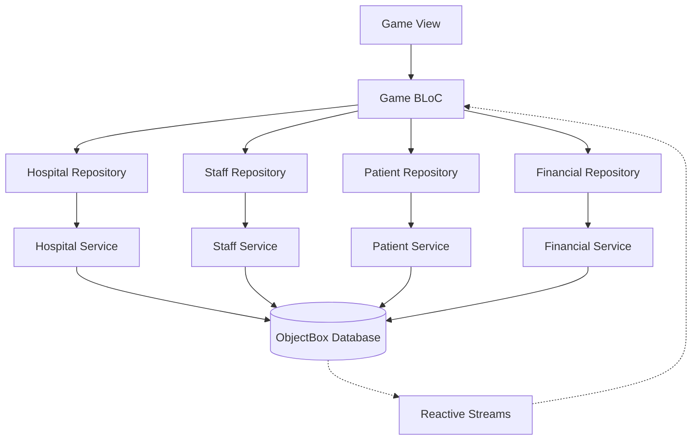

### Game Event System
1. **Player Actions**: View → BLoC → Repository → Service → Database
2. **Automatic Updates**: Timer Events → Game Logic → Repository → Reactive Stream → BLoC → View
3. **Random Events**: Random Generator → Event Handler → Multiple Repositories → UI Updates

### Offline Game Loop
- **Real-time Simulation**: Continuous patient generation and department operations
- **Persistent State**: All game progress saved locally using ObjectBox
- **Background Processing**: Game continues when app is minimized
- **Auto-save System**: Regular state persistence to prevent data loss

## Game Actions Flow

### Hospital Owner Actions Flow

#### Staff Management Actions

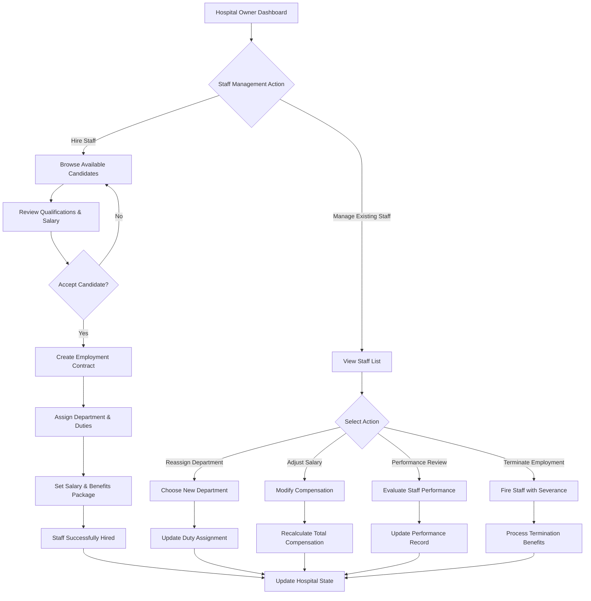

#### Department Operations Actions

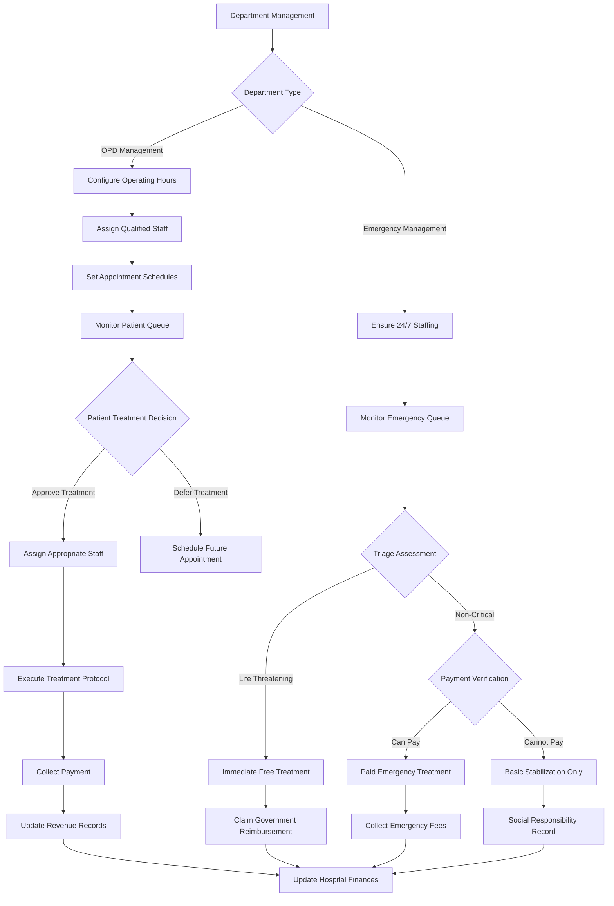

#### Financial Management Actions

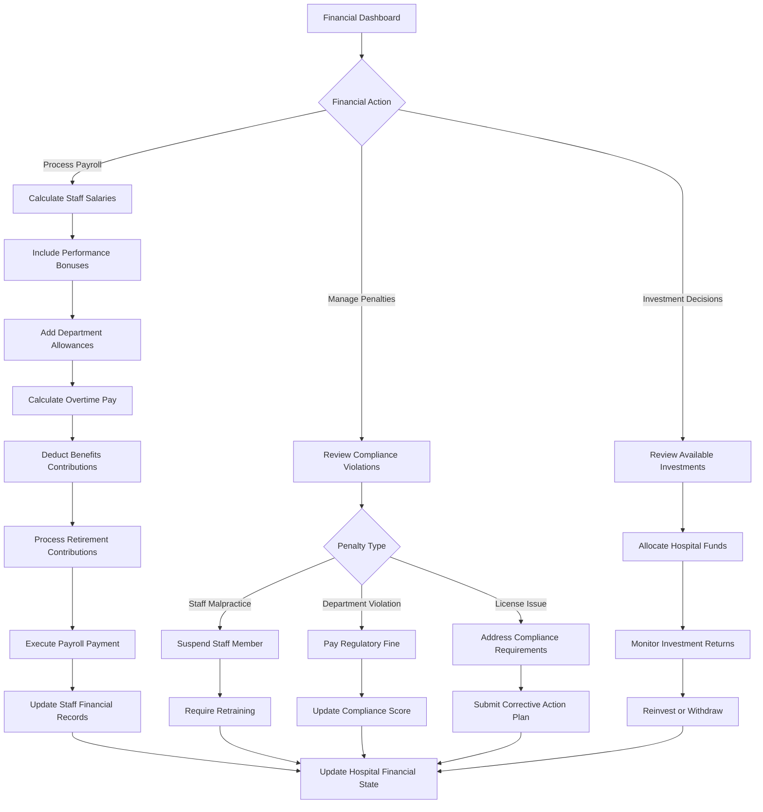

### System-Driven Actions Flow

#### Automated Game Events

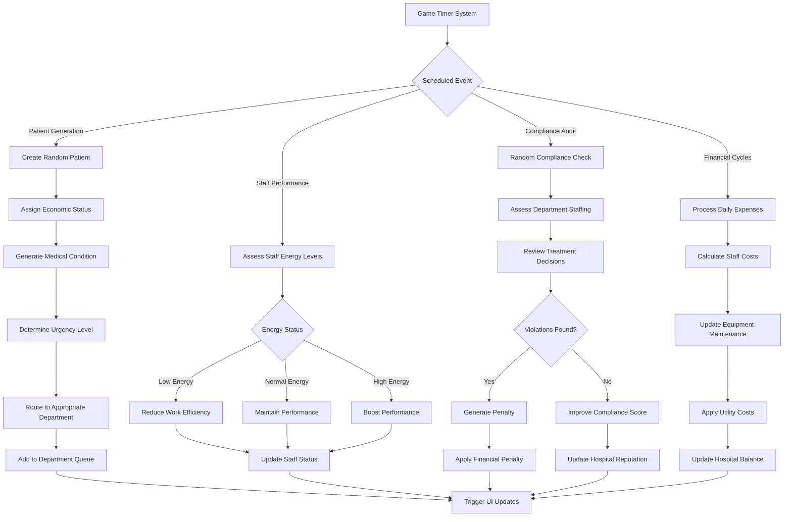

#### Patient Treatment Flow

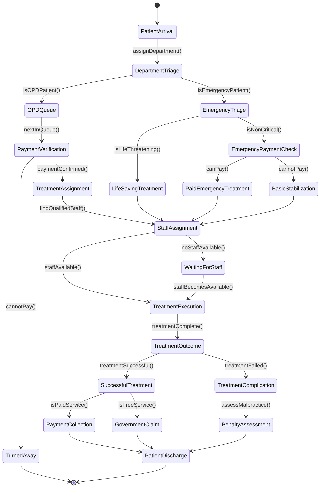

### User Interface Actions Flow

#### Navigation and Screen Flow

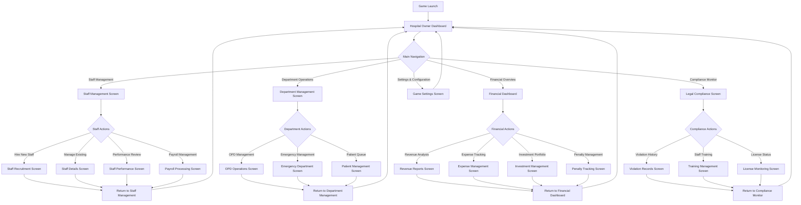

## Offline Game Architecture

### Local Data Persistence (ObjectBox)
- **Complete Fictional Game State**: All virtual hospital data, simulated staff records, generated patient scenarios
- **Salary and Benefits Tracking**: Complete compensation history, benefits enrollment, retirement contributions
- **Legal Compliance Records**: Penalty history, compliance scores, violation tracking
- **Department Assignment History**: Staff duty assignments, performance in specific departments
- **Auto-Generated Content**: Periodic creation of fictional patients, staff candidates, and random compliance events

### Game Services Layer
- **Staff Management Service**: Hiring/firing, duty assignments, salary calculations, benefits administration
- **Payroll Service**: Automated salary processing, overtime calculations, benefits deductions, retirement contributions
- **Compliance Service**: Legal violation tracking, penalty calculations, license status monitoring
- **Performance Service**: Staff evaluation, treatment outcome tracking, departmental efficiency metrics
- **Penalty Service**: Fine calculations, suspension management, retraining requirements

### Game Timer & Simulation Engine
- **Payroll Cycles**: Automated bi-weekly or monthly salary payments with deductions
- **Performance Reviews**: Quarterly staff evaluations affecting salary and benefits
- **Compliance Audits**: Random legal inspections with potential penalty outcomes
- **Retirement Processing**: Automatic pension contributions and vesting calculations
- **Benefits Enrollment**: Annual open enrollment periods for staff benefit selections

## Game Testing Strategy

### Fictional Game Content Testing
- **Content Verification**: Ensure all data is completely fictional with no real-world connections
- **Character Generation**: Test random generation of fictional staff and patient names/profiles
- **Scenario Simulation**: Validate that all medical scenarios are clearly fictional and educational
- **Legal Disclaimer Integration**: Verify prominent display of fictional content disclaimers

### Penalty System Testing
- **Violation Detection**: Test automatic detection of staff misassignment and treatment errors
- **Penalty Calculation**: Validate fine amounts, suspension durations, and compliance scoring
- **Progressive Discipline**: Ensure escalating consequences for repeat violations
- **Legal Compliance Scoring**: Test license risk calculations and compliance recovery mechanisms

### Salary and Benefits Testing
- **Payroll Calculations**: Validate base salary, bonuses, overtime, and deduction calculations
- **Benefits Administration**: Test enrollment, eligibility, and cost calculations for all benefit types
- **Retirement Planning**: Verify pension contributions, vesting schedules, and withdrawal calculations
- **Performance-Based Compensation**: Test bonus calculations based on treatment outcomes and efficiency

### Department Assignment Testing
- **Staff Qualification Matching**: Ensure only qualified staff can be assigned to specific departments
- **Duty Rotation**: Test shift assignments and department transfer functionality
- **Performance Tracking**: Validate department-specific performance metrics and comparisons
- **Compliance Monitoring**: Test detection of unqualified staff performing inappropriate duties

## Game Performance & Scalability

### Offline Performance Optimization
- **Efficient Game Loop**: Optimized timer-based operations for continuous simulation
- **Smart Caching**: Frequently accessed game data cached in memory for smooth gameplay
- **Background Processing**: Non-critical operations (analytics, cleanup) performed asynchronously
- **Resource Management**: Automatic cleanup of old patient records and completed transactions

### Scalability Considerations
- **Progressive Complexity**: Game difficulty scales with player progress and hospital size
- **Dynamic Content**: Patient types and scenarios expand as hospital reputation grows
- **Modular Features**: New departments and specializations can be added without core changes
- **Save File Optimization**: Compressed game state storage for long-term play sessions

### Real-time Game Updates
- **Reactive UI**: Immediate visual feedback for all player actions and automatic events
- **Event Broadcasting**: Efficient propagation of game state changes to all relevant UI components
- **Memory Management**: Proper disposal of streams and listeners to prevent memory leaks
- **Performance Monitoring**: Built-in metrics for game loop performance and user experience

## Game Security & Data Management

### Fictional Content Protection
- **Content Validation**: Automated checks to ensure no real-world healthcare data is referenced
- **Random Generation**: All names, scenarios, and events generated using fictional data sources
- **Disclaimer Integration**: Prominent disclaimers about fictional nature throughout the game
- **Save Game Integrity**: Prevention of save file manipulation affecting game balance

### Game Balance Security
- **Financial Transaction Validation**: Prevent unrealistic salary manipulation or penalty avoidance
- **Staff Assignment Rules**: Enforce qualification requirements and prevent inappropriate duty assignments
- **Performance Metrics Integrity**: Validate treatment outcomes and staff performance calculations
- **Penalty System Enforcement**: Ensure legal consequences cannot be bypassed through game manipulation

### Educational Gaming Framework
- **Realistic Consequences**: Game mechanics reflect real-world business and legal principles
- **Learning Objectives**: Teach hospital management, HR practices, and compliance importance
- **Ethical Decision Making**: Present scenarios requiring balance between profit and proper care
- **Long-term Planning**: Encourage strategic thinking about staff development and retirement planning